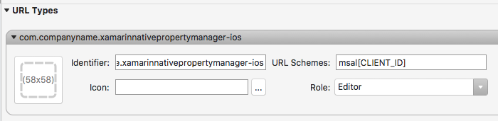
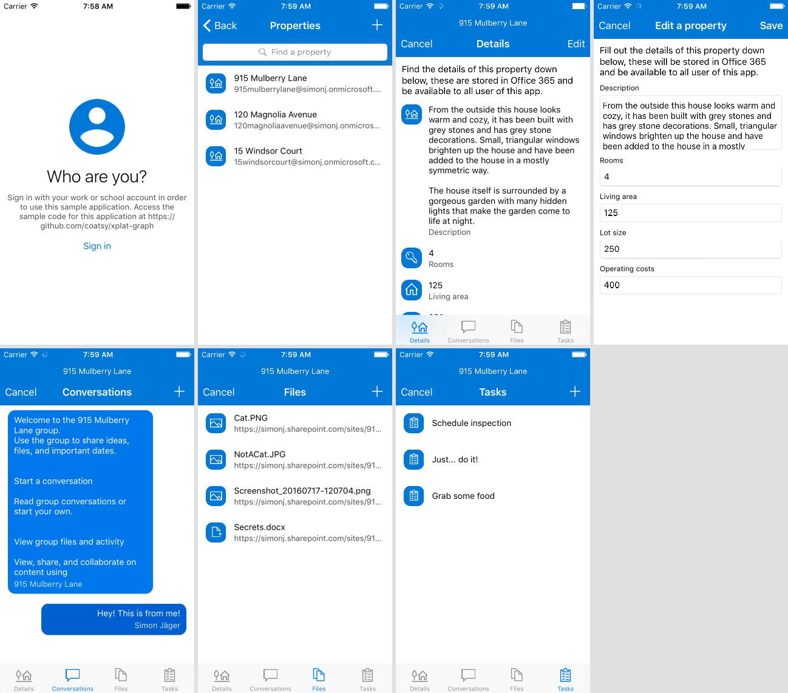
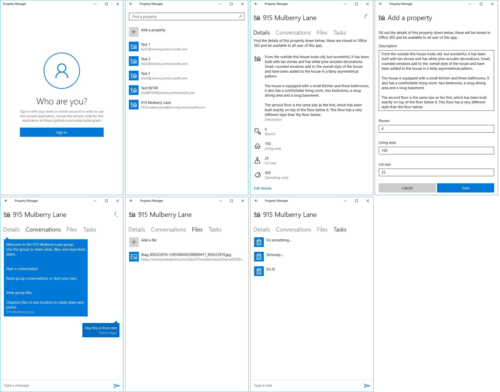

# Microsoft Graph Property Manager Sample for Xamarin Native

## Table of contents

* [Prerequisites](#prerequisites)
* [Register and configure the app](#register-and-configure-the-app)
* [Build and debug](#build-and-debug)
* [Run the sample](#run-the-sample)
* [How the sample affects your account data](#how-the-sample-affects-your-account-data)
* [Contributing](#contributing)
* [Additional resources](#additional-resources)

This sample project demonstrates how to use the Microsoft Graph as the only back-end component for a complete property management solution. The samples covers features such as property details, conversations, files and tasks in a Xamarin Native app.

The purpose of this sample is to demonstrate the ability to create platform user interfaces and experiences (by implementing native views), while sharing common code across platforms and supercharging the solution with the Microsoft Graph. It heavily leverages Office 365 groups in order to organize data into properties.

> **Note** The sample targets the beta branch of the Microsoft Graph, which the [Microsoft Graph .NET Client SDK](https://github.com/microsoftgraph/msgraph-sdk-dotnet) does not implement. Instead, network calls are being made with the built in HTTP stack towards the Microsoft Graph to consume its resources.

The samples uses the [Microsoft Authentication Library (MSAL)](https://www.nuget.org/packages/Microsoft.Identity.Client) for authentication and the [MvvmCross](https://mvvmcross.com/) library to bring the [MVVM pattern](https://msdn.microsoft.com/en-us/library/hh848246.aspx) across platforms with Xamarin.

### Project

Project | Author(s)
---------|----------
XamarinNativePropertyManager | [Simon Jäger](http://simonjaeger.com/) (**Microsoft**)

### Version history

| Version | Date | Comments |
|---------|------|----------|
| 1.0 | August 4th 2016 | Initial release |
| 1.1 | April 4th 2018 | Updated to use MSAL library for auth |

## Prerequisites

This sample requires the following:  

- [Visual Studio 2017](https://www.visualstudio.com/downloads) with the [Xamarin](https://www.xamarin.com/visual-studio) workload installed
- Windows 10 ([development mode enabled](https://msdn.microsoft.com/library/windows/apps/xaml/dn706236.aspx))
-  An Office 365 account - If you are building for Office 365 and you're missing an Office 365 tenant - get yourself a developer account at: https://developer.microsoft.com/en-us/office/dev-program.

If you want to run the iOS project in this sample, you'll need the following:

- The latest iOS SDK
- The latest version of Xcode
- Mac OS X Yosemite (10.10) & above
- [Xamarin.iOS](https://docs.microsoft.com/en-us/xamarin/ios/get-started/installation/mac)

You can use the [Visual Studio Emulator for Android](https://www.visualstudio.com/features/msft-android-emulator-vs.aspx) if you want to run the Android project.

## Register the application 
 
1. Navigate to the [the Azure portal - App registrations](https://go.microsoft.com/fwlink/?linkid=2083908) to register your app. Login using a **personal account** (aka: Microsoft Account) or **Work or School Account**. 
 
2. Select **New registration**. On the **Register an application** page, set the values as follows. 
 
* Set **Name** to `[SUGGESTED APP NAME]`. 
* Set **Supported account types** to **Accounts in any organizational directory and personal Microsoft accounts**. 
* Leave **Redirect URI** empty. 
* Choose **Register**. 
 
3. On the **[SUGGESTED APP NAME]** page, copy the values of both the **Application (client) ID** and the **Directory (tenant) ID**. Save these two values, since you will need them later. 
 
4. Select the **Add a Redirect URI** link. On the **Redirect URIs** page, locate the **Suggested Redirect URIs for public clients (mobile, desktop)** section. Select the URI that begins with `msal` **and** the **urn:ietf:wg:oauth:2.0:oob** URI. 
 
5. [CONFIRM THAT THESE INSTRUCTIONS WORK FOR YOUR SAMPLE] Open the sample solution in Visual Studio and then open the **Constants.cs** file. Change the **Tenant** string to the **Directory (tenant) ID** value you copied earlier. Change the **ClientIdForUserAuthn** string to the **Application (client) ID** value. 
 
Markdown template for native app registration with application permissions (app calls MS Graph): 
All areas to be filled are indicated with square brackets and caps, e.g. [APP NAME]. 
Please reshape the content or headings as needed to match the specific sample's requirements. 
 
## Register the application 
 
1. Navigate to the [the Azure portal - App registrations](https://go.microsoft.com/fwlink/?linkid=2083908) to register your app. Login using a **Work or School Account**. 
 
2. Select **New registration**. On the **Register an application** page, set the values as follows. 
 
* Set **Name** to **Xamarin Native PropertyManager**. 
* Set **Supported account types** to **Accounts in any organizational directory**. 
* Leave **Redirect URI** empty. 
* Choose **Register**. 
 
3. On the **Xamarin Native PropertyManager** page, copy and save the values for the **Application (client) ID** and the **Directory (tenant) ID**. You will need them in step 7. 
 
4. Select **Certificates & secrets** under **Manage**. Select the **New client secret** button. Enter a value in **Description**, select any option for **Expires** and choose **Add**. 
 
5. Copy the client secret value before leaving the page. You will need it in the next step. 
 
6. Open the sample solution in Visual Studio and then open the **Constants.cs** file. Change the **Tenant** string to the **Directory (tenant) ID** value you copied earlier. Similarly, change the **ClientIdForAppAuthn** string to the **Application (client) ID** value and change the **ClientSecret** string to the client secret value. 
 
7. Return to the Azure Active Directory management center. Select **API permissions** and then select **Add a permission**. On the panel that appears, choose **Microsoft Graph** and then choose **Application permissions**. 
 
8. Use the **Select permissions** search box to search for the following permissions: User.Read, Group.ReadWrite.All, Sites.Read.All, Files.ReadWrite.All, Tasks.ReadWrite, Directory.Read.All. Select the check box for each permission as it appears (note that the permissions will not remain visible in the list as you select each one). Select the **Add permissions** button at the bottom of the panel. 
 
9. Choose the **Grant admin consent for [tenant name]** button. Select **Yes** for the confirmation that appears.

## Build and debug

**Note:** If you see any errors while installing packages during step 2, make sure the local path where you placed the solution is not too long/deep. Moving the solution closer to the root of your drive resolves this issue.

1. Open the Constants.cs file inside the **XamarinNativePropertyManager (Portable)** project of the solution.

     

1. After you've loaded the solution in Visual Studio, configure the sample to use your Azure AD tenant by replacing the **[TENANT_ID_OR_NAME]** value in the **Authority** property in the **Constants.cs** file.

     

1. Configure the sample to use your Azure AD application Client Id by replacing the **[CLIENT_ID]** value in the **ClientId** property in the **Constants.cs** file.

     

1. Open the **XamarinNativePropertyManager.Droid/Properties/AndroidManifest.xml** file. Replace the `[CLIENT_ID`] value with your client ID.

    > **Note:** If you're using Visual Studio for Mac, be sure to click the **Source** tab after opening **AndroidManifest.xml**.

1. Open the **XamarinNativePropertyManager.iOS/Info.plist** file. Select the **Advanced** tab and locate the **URL Types** section. Replace `[CLIENT_ID]` with your client ID.

    

1. Select the project that you want to run. If you select the Universal Windows Platform project, you must run the sample on a Windows machine. If you want to run the iOS project, you'll need to either connect to a [Mac that has the Xamarin tools](https://docs.microsoft.com/en-us/xamarin/ios/get-started/installation/windows/connecting-to-mac/) installed on it, or you'll need to build and run the project in Visual Studio for Mac. The Android project can be built and run on either Windows or Mac as long as the Android emulator is installed.

     

1. Press F5 to build and debug. Run the solution and sign in with either your personal or work or school account.

    > **Note** You might have to open the Build Configuration Manager to make sure that the Build and Deploy steps are selected for the UWP project.

## Run the sample

After launching the app, click the **Sign in** button to sign in to your organizational account. After you authenticate, the app displays all the properties in your organization. Create a new one by filling in the details and the app will provision a new Office 365 group for this property. At this point you will be able to post messages to the group conversations, add files and create tasks.

You will also be able to update the details of the property and create new ones. Explore the Office 365 groups in your browser to find all of the data used within the app. The property details are stored in an Excel workbook named **Data.xlsx**, located in the **Property Managers** group. 

### Platform screenshots

#### Android

#### iOS

#### UWP

## How the sample affects your account data

When this sample is started for the first time (in the Office 365 tenant) an Office 365 group named **Property Managers** is created. In this group, a **Data.xlsx** file is stored which hosts all of the details for the different properties.

For each property that is created within the app, a new Office 365 group is provisioned. In each group the files, conversations and tasks resources are used by the app. Tasks are the only thing that can be deleted (completed) from within the app. The app does not provide an ability to delete conversation posts or files. 

## Contributing

If you'd like to contribute to this sample, see [CONTRIBUTING.MD](/CONTRIBUTING.md).

This project has adopted the [Microsoft Open Source Code of Conduct](https://opensource.microsoft.com/codeofconduct/). For more information see the [Code of Conduct FAQ](https://opensource.microsoft.com/codeofconduct/faq/) or contact [opencode@microsoft.com](mailto:opencode@microsoft.com) with any additional questions or comments.

## Additional resources

- [Other Microsoft Graph Connect samples](https://github.com/MicrosoftGraph?utf8=%E2%9C%93&query=-Connect)
- [Microsoft Graph overview](https://developer.microsoft.com/en-us/graph/docs/concepts/overview)
- [Office developer code samples](https://developer.microsoft.com/en-us/office/gallery/?filterBy=Samples)
- [Office dev center](https://developer.microsoft.com/en-us/office)
- [Simon Jäger's blog on #Office365Dev](http://simonjaeger.com/)

## Copyright
Copyright (c) 2016 Microsoft. All rights reserved.